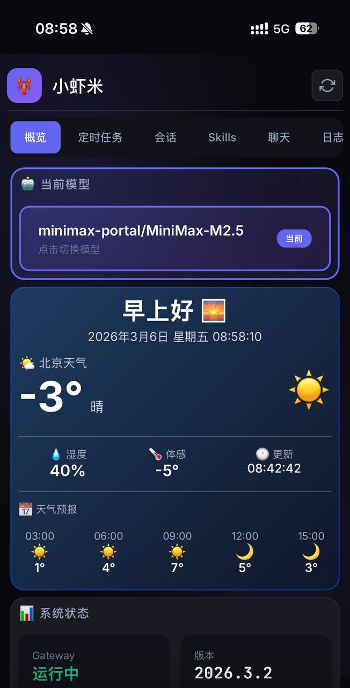
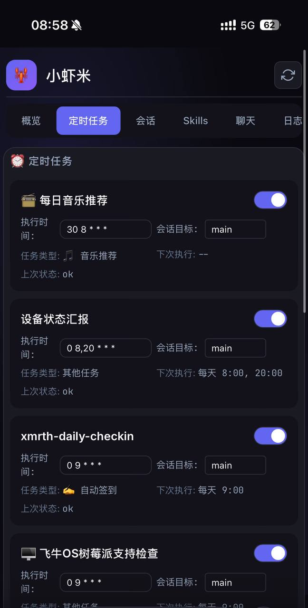
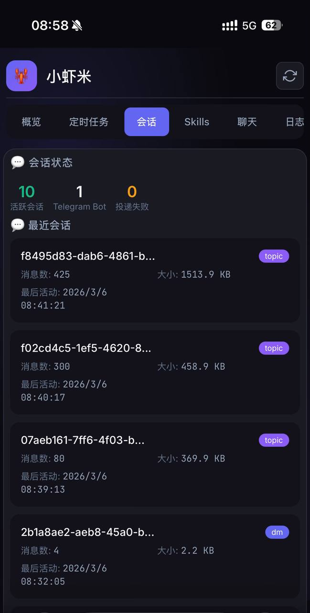
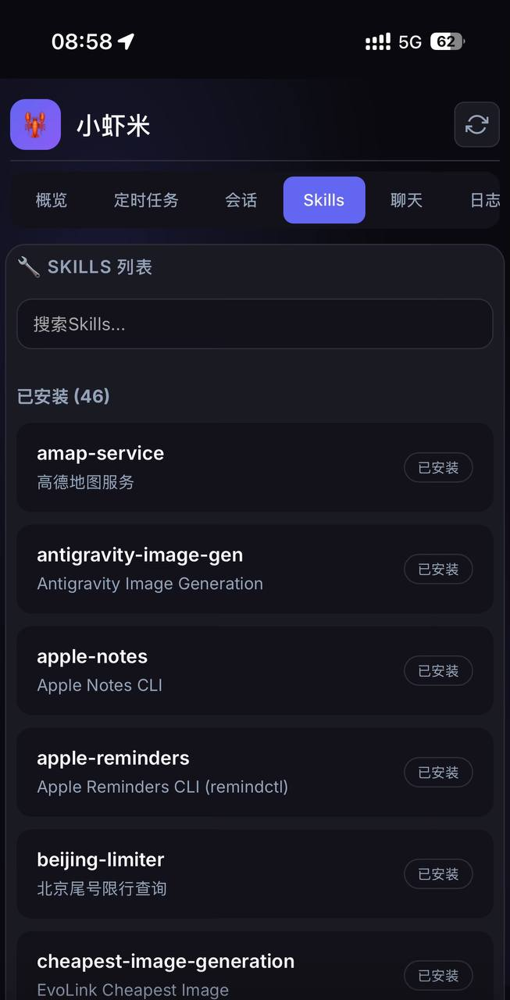
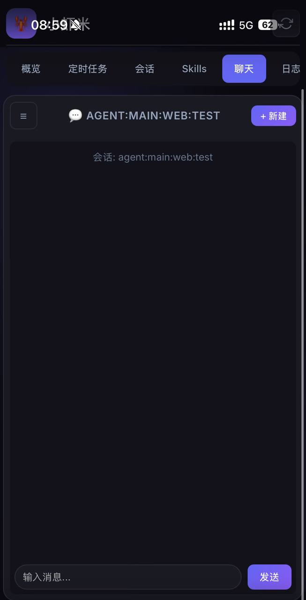
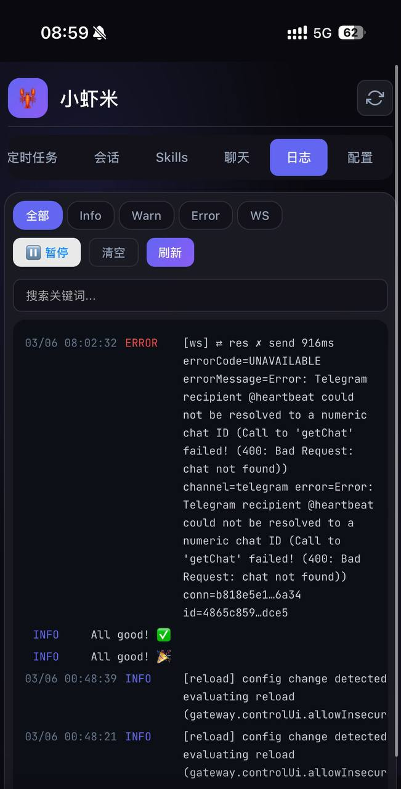
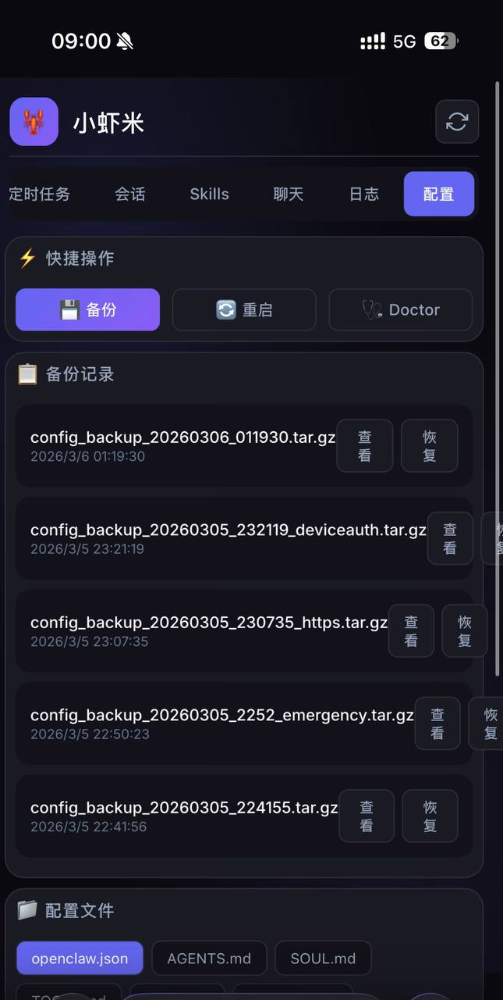
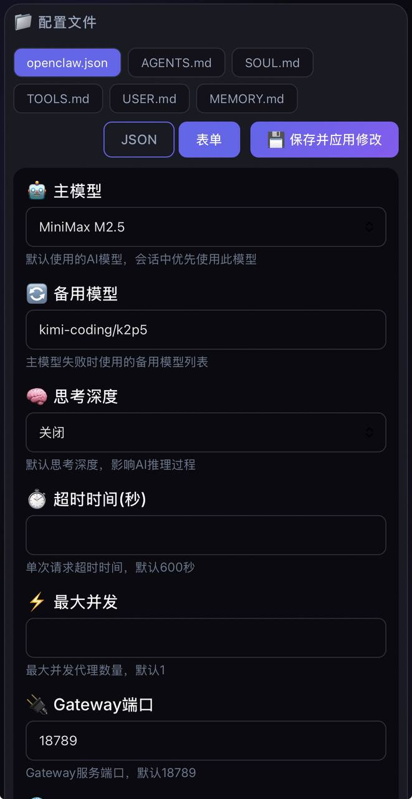

# 🦞 小虾米 - OpenClaw 管理面板

<p align="center">
  
  
  
  
  
  
  
  
</p>

一个美观、实用的 OpenClaw Web 管理面板，支持模型切换、定时任务管理、配置编辑、实时日志查看等功能。

## ✨ 特性

### 🎯 核心功能
- **模型切换** - 一键切换 AI 模型（MiniMax / Kimi），自动设置备用模型
- **定时任务** - 可视化管理 Cron 任务，支持启用/禁用、编辑执行时间和目标会话
- **配置编辑** - JSON/表单两种模式，支持配置验证和保存
- **实时日志** - 自动刷新查看 Gateway 运行日志
- **会话管理** - 查看活跃会话、投递队列、Telegram Bot 状态
- **Skills 管理** - 浏览已安装/可安装 Skills，支持一键安装
- **网页聊天** - 支持创建会话、导入 Telegram 会话、持久化聊天记录、重命名/删除

### 🌤️ 天气组件
- 实时天气数据（OpenWeatherMap）
- 智能问候语（早上好/上午好/中午好/下午茶/晚上好/夜深了）
- 未来天气预报

### 🎨 界面
- 响应式设计，适配桌面和移动端
- 深色主题，护眼舒适
- 全屏自适应宽度
- 自动更新时间（每秒刷新）

## 🚀 快速开始

### 安装

```bash
# 克隆项目
git clone https://github.com/idanielz/openclaw-dashboard.git
cd openclaw-dashboard

# 安装依赖
npm install

# 启动服务
OPENWEATHERMAP_TOKEN=你的Token node server.js
```

### 配置

默认端口：**18790**

| 环境变量 | 说明 |
|---------|------|
| `OPENWEATHERMAP_TOKEN` | OpenWeatherMap API Key（可选）|

### 访问

- 本地：`http://localhost:18790`
- 局域网：`http://你的IP:18790`

### 开机启动（macOS）

```bash
# 已配置 LaunchAgent
launchctl load ~/Library/LaunchAgents/ai.openclaw.dashboard.plist
```

## 📱 功能详情

| 功能 | 说明 |
|------|------|
| 概览 | 显示当前模型、天气、系统状态 |
| 定时任务 | 管理 Cron 任务，支持交互式编辑 |
| 会话 | 查看活跃会话、投递队列 |
| Skills | 浏览已安装/可安装 Skills |
| 日志 | 实时查看 Gateway 运行日志 |
| 配置 | 编辑 OpenClaw 配置文件 |

## 🛠️ 技术栈

- **前端**: HTML/CSS/JavaScript（原生）
- **后端**: Node.js + Express
- **API**: OpenClaw Gateway

## 📄 License

MIT

---

⭐ 如果喜欢，请 Star 支持！
